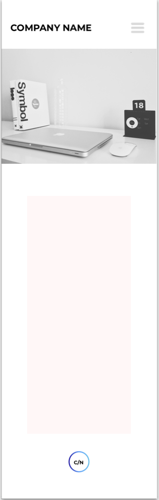
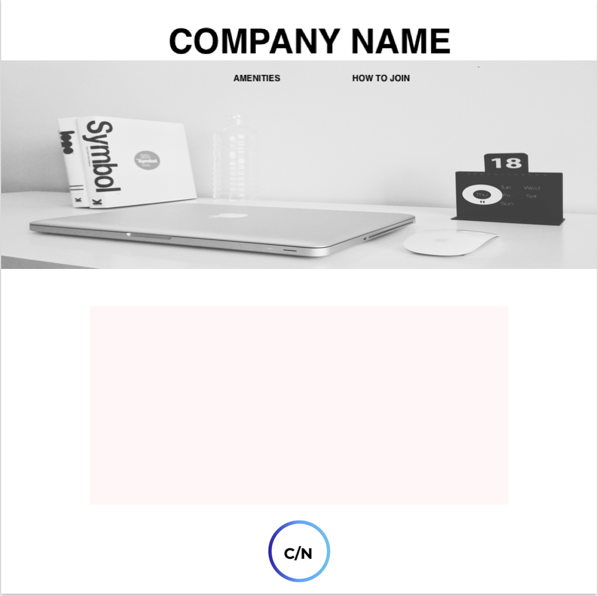

## Co-Working Freelance Project
---

#### Nelia Terrazas
#### March 4th, 2019

### Description

A website showcasing a new co-working startup space. This site is meant to showcase this company's unique and exciting work environment. Here are the client's exact words for what they would like for their final product:

* "We just finished remodeling our space. We're really proud of it. We want our online presence to mirror our in-person presence, to attract people that would really enjoy working in our environment."
* "We want our space--no, our whole company--to feel a little luxurious, cool, and high-end; yet still 100% welcoming and inclusive to everyone. A safe, comfortable, and productive work environment, you know?"
* "I also think it's really important convey our unique personality. It's what sets us apart from the 'big guys' in the field. You know, places like WeWork and TechSpace. We think we're more funky, more local, less corporate, and a little more fun."
* "We want to avoid catering solely to tech. You walk into some of these other coworking spaces, and you only ever see people working on code. That's great, but we'd also love to see artists, daytraders, craftspeople, writers, counselors, more traditional business people--you know, anyone and everyone--in our space."
* "Our site should also show what amenities we have. We have an on-site coffee counter, both communal working areas and private offices, high-speed internet, printing and faxing services, and we usually have a fun, optional activity on Thursday afternoons. Like yoga, maybe a fun complementary food, or like...I don't know, maybe even crafts sometimes (come make your own mini desktop terrarium)?"

#### Desktop Version:

#### Tablet version:

#### Mobile Version:

### Images:

Sketch Wireframes

### User Personas
|   | Madison  |   Charlie    | Allesandra  |   
|---|---|---|---|
| Needs  | A roaster at Stumptown Coffee who is also interested in Marketing  | A young but established software engineer looking for a more inspiring workspace that still has everything he needs to continue to further his career on his own terms  | A fine artist who has recently began to sell her artwork. |
| Pain Points | Hard to navigate, not intuitive  | Trying too hard to be unique, not looking professional  | Lack of originality  |
|How to Serve| Create a site that is different from the rest. Especially in a city like Portland, where there are always new coffee spots opening up, it's important to stand out as the best.  |  No bugs = no problem. Profressional looking site that makes Charlie feel like the young professional that he is and is taken more seriously by potential employers. |  Sleek design that reflects personaily and makes an artist happy and inspired to work. |

### User Stories

* As a craftsperson and specialty coffee roaster, I want a clean, easy to use interface he can explore all possible features of this new workspace.
* As someone interest in Marketing and expanding my business, I want a site that will stand out from the rest and reflect well on my craft.
* As a software developer, I want an exciting site, without bugs, that inspires my creativity so that I can be constantly motivated to continue producing fresh content.
* As a person in tech, I am looking for complete functionality and a reflection of professionalism in the site.
* As a fine artist, I want a site that reflects on my passion and eye for beauty, so that potential clients can tell that I am fully invested in my art, start-to-finish.

### Research, Inspiration, and Brainstorm

For my inspiration, I looked at coworking spaces and coffee shops around Portland. After looking at a lot of sites that seemed to fit with the look and feel that the client was trying to convey. With attention to images, margins, font, fluidity, color choices, and use of logos, I developed an idea for the overall look of the client's site.

### Technologies and Resources

* Sketch
* HTML
* CSS
* Sass

### Responsiveness

Webpages will readjust nav bar display, image size, and main container layout as the viewport changes sizes. There are 3 main viewports in mind: mobile, tablet and desktop.

### Setup Instructions

* Download this repository at https://github.com/neliaterrazas/freelance-project.git
* $ npm install in the terminal to retrieve node_modules folder
* $ npm run build in the terminal to retrieve dist folder
* Open in your favorite text editor to see said folders
* $ npm run start to open a new tab with the live site/ compile code.

### Roadmap

At this moment, I am working on building the actual site and to have it respond to media queries as planned out in wireframes.

### License

MIT License

Copyright (c) 2019 **_Nelia Terrazas_**
